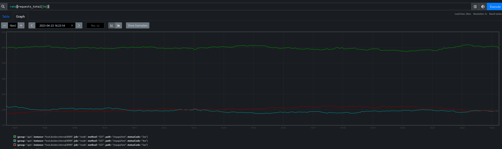
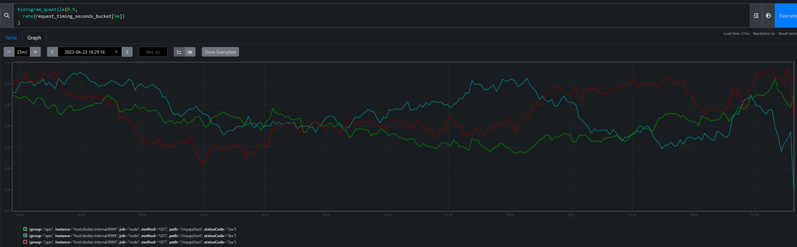
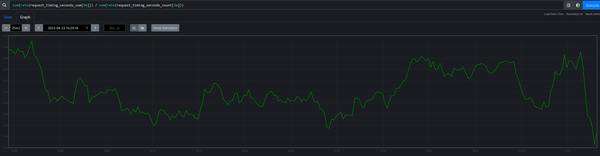

# prom-emw

Prometheus Express Middleware

## Description

Improving API visibility via a simple plugin and forget interface.       

### Current workings
##### Default recordings
- request count as `requests_total` Prom Counter
- request timing as `request_timing_seconds` Prom Histogram

##### Default labels
Currently used default labels are:
- `path` being called
- `method` being used
- `statusCode` being replied

##### Notes:
- `statusCode`s are normalized by prefix, i.e. 2xx, 4xx, 5xx etc

### Installing

```
npm install --save prom-emw
```

### Usage

Given an example express app
```typescript
public async initialise(port: number) {
    const app = express();

    await PromEMW.install(app); // install the MW

    app.get('/myapi/test', (req, res) => {

        const randSample = _.sample([1, 3, 15, 20]);
        switch (true) { // change status randomly
            case randSample % 5 === 0 && randSample % 3 === 0:
                res.status(400);
                break;

            case randSample % 5 === 0:
                res.status(500);
                break;

            default:
                res.status(200);
                break;
        }

        const randomResponseTime = _.sample([0.5, 1, 1.5, 2]);
        setTimeout(() => { // reply in random times
            return res.json('Hello');
        }, randomResponseTime * 1000);
    });

    app.listen(port);
    logger.info(`Listening on port: ${port}`);
}
```

#### Example observations
For more queries examples, look into PromQL https://prometheus.io/docs/prometheus/latest/querying/basics/

###### Request rate over time


###### 90 quantile slow request timings


###### Average request timing rate over time


### Configuration
```typescript
interface IMWOpts {
    // Prom collection endpoint path
    collectionPath?: string; // defaults to /metrics 

    // App name to be appended to Prom metric type names
    appName?: string; // defaults to ''
}
```

### TODOs
- more config flexibility and options
- more tests
- pm2 cluster support
- custom metrics
- nodejs cluster support if desired


## License
This library is licensed under the Apache 2.0 License